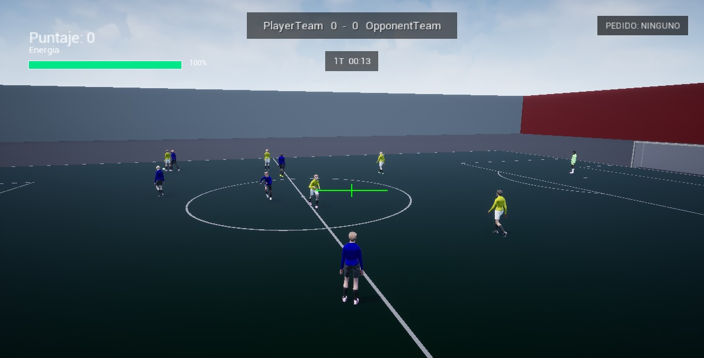
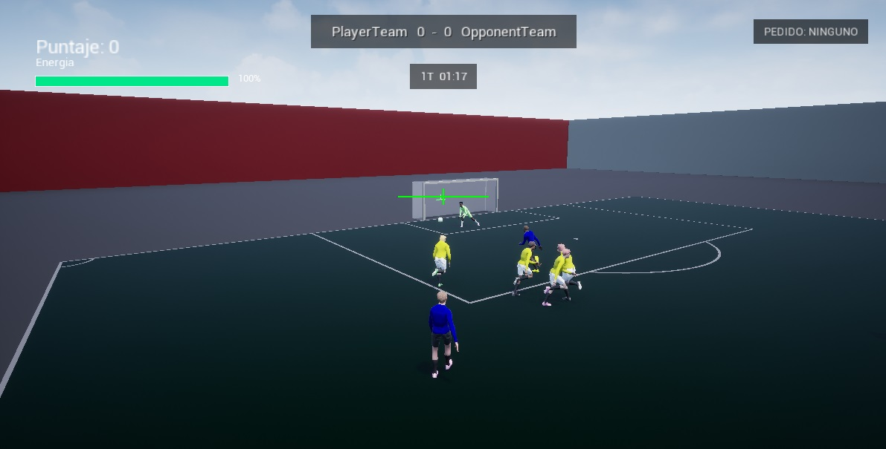
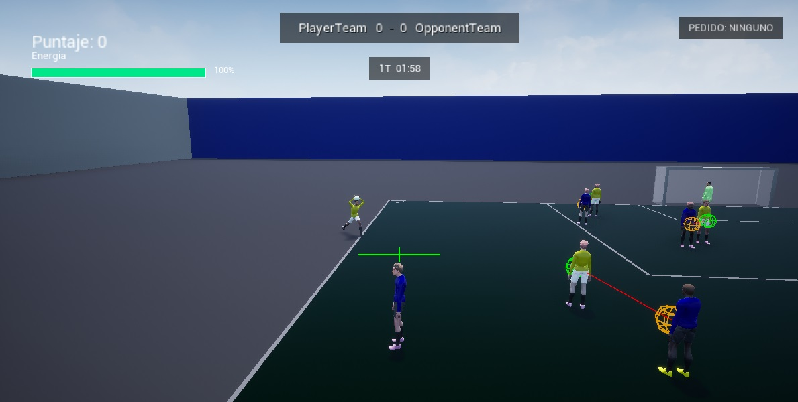

# Futbol7

[English](README.md)

**Futbol7** es un proyecto de jugabilidad de fútbol en desarrollo, creado con **Unreal Engine 4.27 y C++**.

> **Nota técnica:** el proyecto de Unreal y el módulo C++ todavía se llaman `ThirdPersonCpp`, porque el desarrollo comenzó a partir del template Third Person de Unreal con su nombre por defecto. El nombre público y conceptual del proyecto es ahora **Futbol7**. Más adelante se podrá migrar también el nombre interno del proyecto y del módulo.

El objetivo principal es construir un juego de fútbol en el que el jugador controlado por una persona y los compañeros/rivales controlados por IA compartan el mismo entorno de partido, reglas, interacciones con la pelota, comportamiento táctico, animaciones y sistemas de reanudación.

El repositorio se encuentra en desarrollo activo. El foco actual no está puesto todavía en el pulido visual ni en ofrecer un juego terminado, sino en construir una base sólida de gameplay sobre la cual pueda desarrollarse un juego de fútbol completo.

---

---

---

---

## En qué se está trabajando actualmente

El desarrollo está centrado principalmente en:

- Toma de decisiones y posicionamiento táctico de la IA
- Interacción del humano y los bots con la pelota
- Reglas de partido y estados de reanudación
- Comportamiento del arquero
- Pases, remates, dribble e intercepción
- Interacciones con pelotas aéreas
- Tackles, faltas y penales
- Sincronización entre animaciones y gameplay
- Refactorización de situaciones de partido en sistemas más claros
- Uso de las dimensiones reales de la cancha en lugar de posiciones hardcodeadas

Una parte importante del desarrollo consiste en probar repetidamente situaciones de partido, encontrar casos límite y mejorar la interacción entre reglas, navegación, animaciones, física e inteligencia artificial.

---

## Sistemas de gameplay implementados

### Flujo del partido y reglas

El proyecto ya contiene sistemas funcionales o parcialmente desarrollados para:

- Saque del centro
- Saques laterales
- Saques de arco
- Córners
- Tiros libres
- Reanudaciones por offside
- Penales
- Detección de goles y pelota fuera de juego
- Seguimiento de posesión
- Registro del último jugador que tocó la pelota
- Restricción de doble toque en reanudaciones
- Fases de preparación y ejecución de pelota parada

Los sistemas de reanudación se están organizando progresivamente en fases más claras:

1. Configuración
2. Preparación
3. Ejecución

Esto permite controlar mejor el posicionamiento de los jugadores, la interacción con la pelota y el comportamiento de la IA antes de volver al juego normal.

---

## Jugador controlado por el humano

El jugador humano actualmente cuenta con sistemas como:

- Movimiento manual
- Persecución de la pelota
- Pases
- Remates
- Dribble / autopase
- Tackle
- Acciones aéreas
- Pedido de pases a compañeros controlados por IA
- Recepción de pases de bots
- Ejecución de distintas reanudaciones

El humano puede convertirse dinámicamente en el ejecutante de determinadas reanudaciones si se encuentra cerca de la pelota. Si se aleja antes de comprometerse con la ejecución, un compañero controlado por IA puede hacerse cargo automáticamente.

Actualmente el humano puede ejecutar:

- Tiros libres
- Saques del centro
- Saques de arco
- Córners
- Saques laterales

Los laterales utilizan una secuencia específica con las manos en lugar del sistema normal de patadas.

---

## Inteligencia artificial de fútbol

Los jugadores controlados por IA están siendo desarrollados alrededor de roles tácticos y comportamiento contextual, en lugar de limitarse a perseguir la pelota.

Entre los sistemas actuales de IA se incluyen:

- Fases ofensivas y defensivas por equipo
- Responsabilidades de presión, apoyo y cobertura
- Mantenimiento de la forma táctica del equipo
- Desmarques
- Marcaje defensivo
- Posicionamiento de rest-defense
- Marcaje de receptores peligrosos
- Intercepción predictiva de la pelota
- Decisiones de pase
- Autopases
- Respuesta a pedidos de pase del humano
- Selección de ejecutantes y receptores en reanudaciones
- Recuperación de navegación cuando un jugador termina fuera de la cancha

Los bots también pueden elegir al jugador humano como receptor durante distintas reanudaciones cuando el pase resulta conveniente.

---

## Sistemas del arquero

Los arqueros cuentan con lógica propia, incluyendo:

- Captura de la pelota con las manos
- Posesión protegida mientras sostienen la pelota
- Distribución con las manos
- Posicionamiento respecto del arco
- Respuesta a remates
- Posicionamiento en penales
- Retorno hacia el arco
- Movimiento y animaciones específicas

El comportamiento del arquero continúa siendo refinado, especialmente en posicionamiento, recuperación y toma de decisiones luego de atajadas o salidas agresivas.

---

## Pases e intercepción

La persecución de la pelota no se basa únicamente en seguir su posición actual.

El proyecto incluye lógica de intercepción predictiva utilizada tanto por los bots como por el sistema de persecución del jugador humano. Los jugadores pueden estimar hacia dónde se dirige la pelota e intentar interceptar su trayectoria futura.

El sistema de pases también distingue distintas intenciones:

- Pase a un compañero
- Pase pedido por el humano
- Pase aéreo
- Autopase
- Pase durante una reanudación

Los compañeros controlados por IA intentan respetar la intención de un pase y evitar tratar inmediatamente la pelota como si estuviera libre.

---

## Tackles, faltas y caídas

El proyecto incluye tackles deslizantes con detección de faltas relacionada con la animación.

Actualmente se trabaja con:

- Tackles con pierna izquierda y derecha
- Detección de contactos
- Reconocimiento de faltas
- Detección de penal dentro del área
- Reacciones de caída para bots y humano
- Recuperación luego de la caída
- Recuperación de jugadores que terminan una animación fuera del volumen de navegación

La intención es que el timing de la animación tenga consecuencias reales sobre el gameplay, en lugar de ser puramente visual.

---

## Interacciones aéreas

Se están desarrollando distintas situaciones de pelota aérea, entre ellas:

- Cabezazos con los pies en el piso
- Control con el pecho
- Cabezazos con salto
- Disputas aéreas
- Rebotes dirigidos

También se utilizan datos de animaciones exportados desde Blender para ayudar a sincronizar el momento de contacto entre jugador y pelota.

---

## Sistema de animaciones

El proyecto utiliza assets de animación importados en Unreal Engine y sincronizados con la lógica de gameplay escrita en C++.

Algunos ejemplos:

- Pases parado
- Pases corriendo
- Pases laterales
- Remates largos
- Tackles
- Caídas
- Saques laterales
- Acciones del arquero
- Cabezazos y controles con el pecho

Cuando resulta conveniente, el humano y los bots mantienen lógicas separadas aunque utilicen assets de animación similares.

En el sistema de patadas de la IA, la pelota puede permanecer quieta hasta el instante real de impacto del montage, en lugar de salir inmediatamente cuando el bot toma la decisión de patear.

---

## Geometría de la cancha

Uno de los objetivos importantes del proyecto es evitar posiciones de cancha hardcodeadas.

Los cálculos relacionados con el campo intentan depender del sistema de dimensiones de la cancha, de modo que la lógica pueda adaptarse si en el futuro cambian las medidas del campo o se crean estadios diferentes.

Esto afecta sistemas como:

- Ubicación de reanudaciones
- Posicionamiento en penales
- Posiciones ofensivas y defensivas
- Recuperación de jugadores fuera del campo
- Referencias de los arcos
- Espaciado táctico

---

## Debug y pruebas

El proyecto contiene herramientas específicas de debugging para visualizar y probar distintos sistemas de gameplay.

Entre ellas:

- Trayectorias predichas
- Puntos de intercepción
- Objetivos de movimiento
- Posiciones tácticas
- Comportamiento del arquero
- Puntos de contacto aéreo
- Información de estado del partido

El debug se está centralizando progresivamente para evitar que cada clase mantenga sistemas visuales independientes.

---

## Tecnologías utilizadas

- **Unreal Engine 4.27**
- **C++**
- **Visual Studio 2022**
- **Blender**
- **Assets y animaciones basados en Mixamo**
- Animation Blueprints y Animation Montages de Unreal
- Sistema de navegación / NavMesh de Unreal

---

## Estado del proyecto

Este es un proyecto **experimental y en evolución activa**.

Muchos sistemas ya funcionan durante el gameplay, pero se siguen probando y ajustando a medida que nuevas interacciones revelan casos límite. La refactorización forma una parte importante del desarrollo porque una misma situación de fútbol puede involucrar al mismo tiempo IA, navegación, física, reglas, animaciones e input del jugador.

Por eso el repositorio debe considerarse una captura del desarrollo actual y no un producto terminado.

---

## Dirección del desarrollo

El trabajo futuro continuará enfocado en:

- Mejorar la IA táctica
- Refinar las decisiones del arquero
- Ampliar las interacciones aéreas y defensivas
- Mejorar las reanudaciones
- Refinar la sincronización entre animación y gameplay
- Reducir casos límite relacionados con navegación e interacciones físicas
- Continuar la refactorización de los estados del partido
- Avanzar hacia un partido de fútbol cada vez más completo y jugable

---

## Notas

Futbol7 se desarrolla principalmente como un entorno de aprendizaje y experimentación sobre **programación de gameplay, inteligencia artificial, integración de animaciones y simulación de sistemas de fútbol**.

El código cambia con frecuencia a medida que los sistemas son probados, corregidos y rediseñados.
